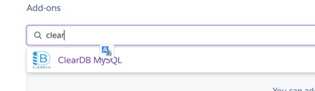
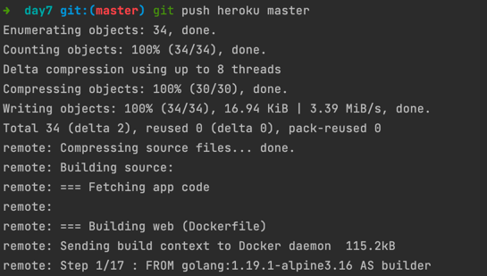

# how to deploy to heroku
### create a heroku account
### install heroku cli
### create a heroku app

### create Mysql database

### set environment variables

###  add a remote to your git repo
```shell
heroku git:remote -a agmc-alterra-day8
```
### set stack to container
```shell
heroku stack:set container
```
###  push to heroku
```shell
git push heroku master
```

###  open the app in browser

### Test Postman

###  check the logs
```shell
heroku logs --tail
```
